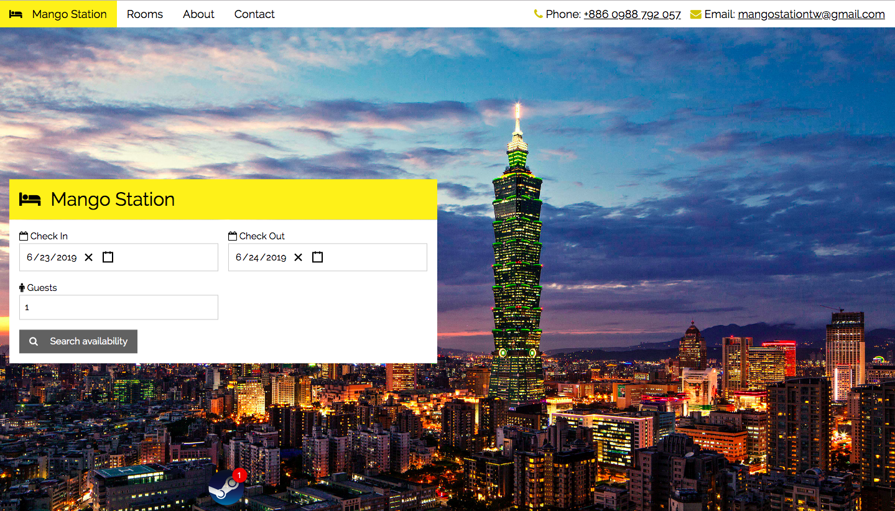
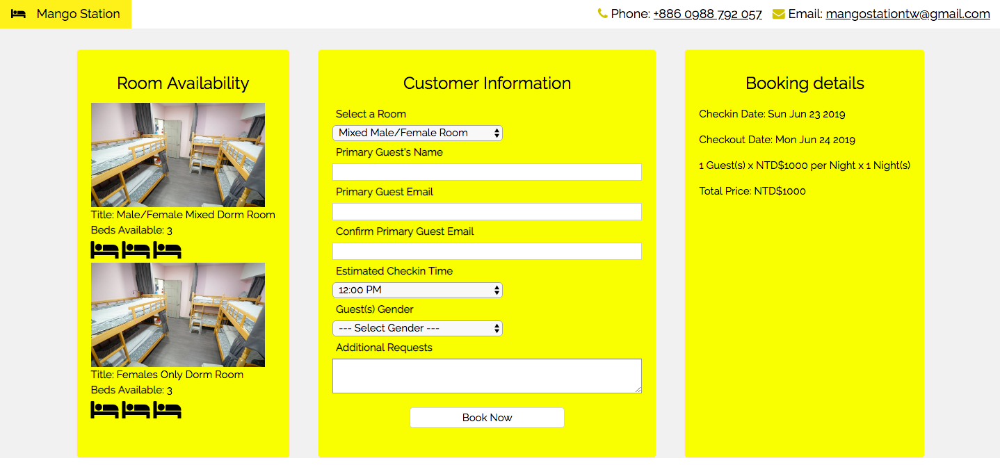
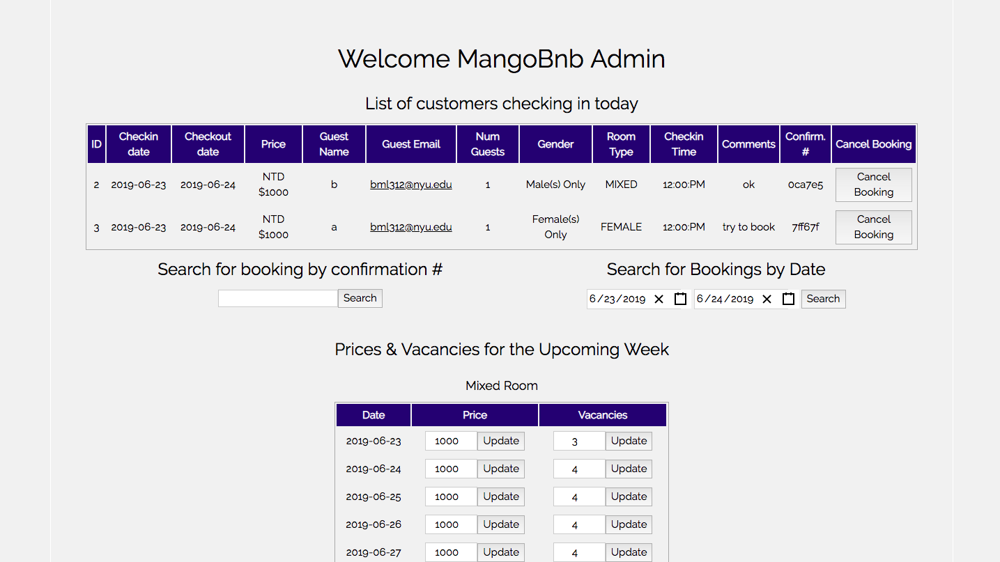

# README
<h3>Professional Hotel Website</h3>
<a src ="http://mangobnb.com">

<h3>Single AJAX App, RESTful Rails API Backend</h3>
 
<h5>Home Page</h5>

 
 
<h5>Booking</h5>

 
 
<h5>Admin</h5>

 
 
<h5>Key Features</h5>
<ul>
  <li>Indexes booking data for fast booking and confirmation retrievals.</li>
  <li>Data sync between components and stores implemented through Redux archtecture.</li>
  <li>Allows for instantaneous price and room availability changes via an admin terminal./li>
  <li>Preprocesses large images before upload to Amazon S3 to allow for scale.</li>
  <li>Provides seamless mobile experience with Responsive Design.</li>
</ul>

* About

Ruby version ~ 2.5.1

Rails ~ 5.2.2

Node ~ 10.13.0

* Configuration

Clone this git repo.

Install gem files. <code>bundle install</code>

Setup the database <code>rails db:setup</code>

Install node modules <code>npm install</code>

Run webpack <code>npm run webpack</code>

Boot the rails server <code>rails s</code>

App should appear on localhost:3000

* Database Schema

For the main booking scheme, the key tables are: Users, Bookings, Rooms, Prices, and Restrictions.

Bookings model has foreign key and indexes on Users, Rooms, and Prices.
	
Restrictions allow for admin to control vacancy count for a given room.

#app/models/room.rb
<code>restrictions.map{|restriction| vacancy_count[restriction.restriction_date] += restriction.net_vacancies} unless restrictions.empty?</code>

* Testing

<b>FactoryBot</b> and <b>Faker</b> gems are used to create mocks for testing.
<code>spec/factories/guest_model.rb</code>
<code>
FactoryBot.define do
  factory :guest do
    name {Faker::Name.name}
    email {Faker::Internet.email}
    gender {Faker::Gender.binary_type}
  end
end
</code>

RSpec is the testing suite used for this app.

To run tests, execute: <code>bundle exec rspec <filename> </code> 

* To-Do List

<ul>
	<li>Add a slideshow to the rooms section</li>
	<li>Animate buttons when clicked</li>
</ul>
